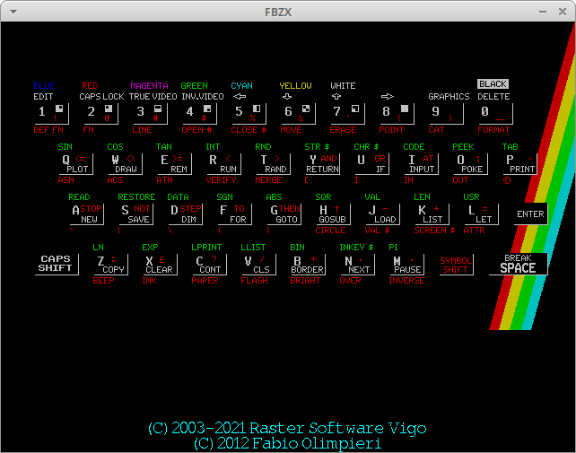

-*- encoding: utf-8; indent-tabs-mode: nil -*-

PURPOSE
=======

Since late 2022, generative artificial intelligence is available to anyone
with an Internet connection. I have even been told that some people use
IA chat programs as psychoanalysts. That reminds me of a forerunner of
AI psychoanalysts, Eliza, written in the 1960's.

The BASIC  version of Eliza  was published  in David Ahl's  book _More
Computer Games_, a  sequel of his best-seller  _Basic Computer Games_.
So  my interest  in  Eliza  expanded into  an  interest  in the  Basic
computer games from these books.

This repository describes  my efforts to get these  computer games and
to run them.

GAME PROGRAMS
=============

Eliza
-----

[Eliza](https://en.wikipedia.org/wiki/ELIZA)
was not written  by David Ahl, but by Joseph  Weizenbaum. Many sources
are provided by
[a Github repository](https://github.com/jeffshrager/elizagen.org),
in various programming languages. Since I am interested only in Basic
versions, I have selected, more or less randomly,
[a 1979 version](https://github.com/jeffshrager/elizagen.org/blob/master/Other_Elizas/1979_EricPlatt_DR_CHALLENGER_CLEAN.BAS),
[a 2013 version](https://github.com/jeffshrager/elizagen.org/blob/master/Other_Elizas/20130209_www.jesperjuul.net%7Celiza%7CELIZA.BAS)
available at
[another address](https://jesperjuul.net/eliza/ELIZA.BAS)
and [another 2013 version](https://github.com/jeffshrager/elizagen.org/blob/3f3414c8a3e359e5f392d92883241d3bd41e7988/Other_Elizas/20120310ShragerNorthEliza.c64basic).

Actually, as  seen just  below, I  have not used  these files,  I have
found another version.

Basic Computer Games
--------------------

[Both](https://www.atariarchives.org/basicgames/)
[books](https://www.atariarchives.org/morebasicgames/)
by David Ahl are available from
[Atari Archives](https://www.atariarchives.org/),
with a
[third book](https://www.atariarchives.org/bigcomputergames/)
I did not know about. Among all the programs, we certainly find
[Eliza](https://www.atariarchives.org/morebasicgames/showpage.php?page=56).

The problem  is that these  files are available  as GIF images.  So we
would need some OCR programs to  convert them into ASCII source files.
Fortunately, the programs  from the first book are available  as a Zip
archive and as a tar.gz archive on the
[Vintage Basic webpage](http://www.vintage-basic.net/games.html)
and the programs from the second book are available as a Zip archive at
[another website](https://www.roug.org/retrocomputing/languages/basic/morebasicgames).

The first two books are also available on the
[archive.org](https://archive.org/details/basic-computer-games-microcomputer-edition_202207)
[website](https://archive.org/details/More_BASIC_Computer_Games),
displaying the  contents as GIF images  (or JPEG? or PNG?).  There are
links to download the whole book as a text file or as a PDF file. Yet,
in the text files,  there are many OCR errors. So we  must use the Zip
archives instead.

BASIC INTERPRETERS
==================

The [BASIC  language](https://rosettacode.org/wiki/99_Bottles_of_Beer/Basic)
has changed  in spades between  its first days  in 1965 and  now. Line
numbers have disappeared, now you have user functions with parameters,
you have local variables with well-specified scope. A
[modern program](https://rosettacode.org/wiki/10001th_prime#BASIC256)
has a very different look when compared with a
[classical program](https://rosettacode.org/wiki/10001th_prime#GW-BASIC).

Since the games have been written in the 1970's, I need an interpreter
which accepts the classical syntax with line numbers and the like.

For my  tests, I  use a virtual  machine with xubuntu  25.04. I  use a
virtual machine, because uninstalling a software can be simply done by
restoring a previous  snapshot. I choose xubuntu, because  it has more
software packages  related to BASIC  than other distributions  such as
Fedora. 25.04  because it is  the most recent xubuntu  virtual machine
installed on my computer.

brandy
------

The [website](https://brandy.matrixnetwork.co.uk/)
mentions version 1.23.6, the APT package has version 1.23.4.

When I test the minimal program `test1.bas` from `bcg.tar.gz`:

```
10 print "I am test 1"
20 end
```

The `brandy` interpreter crashes:

```
$ brandy test1.bas
heap.c:init_workspace: Requested heapsize is 67108864 (&4000000)
heap.c:init_workspace: Allocating at 0x400000, size &4000000
heap.c:init_workspace: mmap returns 0x400000
```

I have tried a few other programs, they crash in the same fashion.

Yet, if I type no filename  in the command line, the interpreter opens
an  input window  and  I  can type  BASIC  statements  in this  window
(upper-case only,  lower-case letters trigger syntax  error messages).
The `test1.bas` program  fails, because it contains  `print` and `end`
in  lowercase chars.  On the  other hand,  several other  programs run
successfully, such as `sinewave.bas`, `amazing.bas` and `love.bas`. Or
there are a few errors, such as  `bunny.bas` in which the array `B` is
not    declared,   or    `eliza.bas`   (the    one   extracted    from
`morebasicgames.zip`) which uses  a `P$` variable in  line 255 without
defining it.

The most serious  problem is that the window  cannot change dimensions
and you cannot scroll back to the previous lines (no scrollbars).

A few useful commands:

```
HELP
HELP "."
HELP "LOAD"
LOAD "amazing.bas"
RUN
QUIT
```

Note that  the commands must  be typed  with upper-case chars.  On the
other hand,  filenames must be typed  as they appear when  listing the
file directory.

bwbasic
-------

The [website](https://sourceforge.net/projects/bwbasic/)
mentions version 3.40, available since 2025-10-23. The APT package has
version 2.20pl2.

To invoke  the interpreter, the  command is `bwbasic`. It  accepts the
pathname for a  BASIC source file as a CLI  parameter. The interpreter
uses the  current xterm window to  interact with the user,  so you can
browse the previous lines by using the scroll bars.

Lower-case  letters are  allowed.  On the  other  hand, some  problems
arise. For  example, in `sinewave.bas`,  a comment is prefixed  by the
pseudo-keyword   `REMARKABLE`  (with   a  `REM`   prefix),  but   this
interpreter does not understand the trick. Also, in many programs, the
interpreter does  not recognise  the `NEXT` end-of-loop  statements if
they are not the first statement in the line.

More surprising:  when I run  `calendar.bas`, after fixing  the `NEXT`
statements not  at the beginning  of a  line, I have  errors seemingly
attributed to  `sh`. These  are not  blocking errors.  But there  is a
blocking error, with an array `M`,  declared with `DIM M(12)`, and for
which the program uses indices 0 to 12:

```
bwBASIC: load "calendar.bas"
bwBASIC: run
                               CALENDAR
              CREATIVE COMPUTING  MORRISTOWN, NEW JERSEY
sh: 1: PRINT:PRINT:PRINT: not found
sh: 1: REM: not found
sh: 1: Syntax error: "(" unexpected
sh: 1: 10: not found
sh: 1: FOR: not found
sh: 1: NEXT: not found

ERROR in line 160: in dim_check(): array subscript var <M> pos <0> val <2> out
of range <0>-<1>.
```

About `eliza.bas` (from `morebasicgames.zip`), the "shell" errors are still
there. The blocking problem in this program is that there is some loss
of  synchronisation  between  the  `DATA` statements  and  the  `READ`
statements. The  program reads  several strings  and then  switches to
reading  numeric  data. The  problem  is  that  for some  reason,  the
internal  `DATA` pointer  still designates  a `DATA`  string when  the
numeric `READ` is executed.

```
bwBASIC: load "eliza.bas"
bwBASIC: run
                         ELIZA
                   CREATIVE COMPUTING
                 MORRISTOWN, NEW JERSEY
sh: 1: PRINT:PRINT:PRINT: not found
sh: 1: REM: not found
sh: 1: Syntax error: "(" unexpected

ERROR in line 140: expression <WHEN?> is not a numerical constant.
bwBASIC:
```

gambas
------

The [website](https://gambaswiki.org/website/en/main.html)
mentions version 3.21.2, the APT package has version 3.20.2.

The `gambas3`  command launches a full  development environment, which
allows you  to create a  full graphic  application, instead of  just a
CLI-oriented program. It  is too much complicated for  my needs, which
are just running (and possibly updating) BASIC programs created in the
1970's.

yabasic
------

The [website](https://2484.de/yabasic/)
mentions version  2.91.4, available  since 31st  August 2025.  The APT
package has version 2.91.1 available since 24th January 2025.

The  `yabasic`  command accepts  a  filename  as  a parameter.  If  no
filename is  provided, it enters  a CLI  interface where you  can type
your  program  on  the  fly  and  run it.  Once  the  program  is  run
(on-the-fly program or source file), `yabasic` ends and yields control
to shell. If the program does not  take input from the user, or if the
user can prepare  the input data before running the  program, the call
to `yabasic`  can be  part of a  shell pipeline or  its output  can be
redirected with `>`.

Example with `love.bas`, which takes a single input from the user:

```
echo kisses | yabasic love.bas | less
```

Some syntactic features of the 1970-era BASIC interpreters are missing
from `yabasic`. All examples are taken from `sinewave.bas`.

* print several arguments separated with semicolons

  ```
  ---Error: syntax error
     10 PRINT TAB(30); "SINE WAVE"
                       ^~~~~~~~~~~
  ---Error: Couldn't parse program
  ---Error: Program not executed
  ```

  But you can print several arguments if they are separated with commas.

* find a keyword hidden inside a supposedly normal identifier

  ```
  ---Error in sinewave.bas, line 4:
  ---Error: syntax error
     40 REMARKABLE PROGRAM BY DAVID AHL
                   ^~~~~~~
  ---Error: Couldn't parse program
  ---Error: Program not executed
  ```

* implicit `GOTO` in a `IF ... THEN` construct

  ```
  ---Error in sinewave.bas, line 10:
  ---Error: syntax error
     140 IF B=1 THEN 180
                     ^~~
  ---Error: Couldn't parse program
  ---Error: Program not executed
  ```

* a `IF ... THEN` construct must be closed with a `ENDIF`

  ```
  ---Error in sinewave.bas, line 16:
  ---Error: a closing endif is expected before next
     200 NEXT T
         ^~~~
  ---Error: if-statement starting at line 10 has seen no 'endif' yet
     200 NEXT T
         ^~~~
  ---Error: syntax error
     200 NEXT T
              ^
  ---Error: Couldn't parse program
  ---Error: Program not executed
  ```

  You may use [`FI`](https://2484.de/yabasic/yabasic.htm#ref_fi)
  instead of `ENDIF`.

* the `TAB` function which should generate a string with _n_ space chars is not known

  ```
  ---Error in sinewave.bas, line 1:
  ---Error: 'TAB()' is neither array nor subroutine
     10 PRINT TAB(30), "SINE WAVE"
                    ^
  ---Error: Program stopped due to an error
  ```

  Actually, we must use
  [function `string$()`](https://2484.de/yabasic/yabasic.htm#ref_string).

  Or else, we  can create a user subroutine. The  only problem is that
  its name cannot be `TAB`, but  `TAB$` since it produces a string (or
  `tab$`,   but   you   should   be  consistent,   these   names   are
  case-sensitive).

  ```
  10 PRINT tab$(30), "SINE WAVE"
  20 PRINT tab$(15), "CREATIVE COMPUTING  MORRISTOWN, NEW JERSEY"
  [...]
  130 PRINT tab$(A);
  [...]
  300 sub tab$(n)
  310 return string$(n, " ")
  320 end sub
  ```

Vintage BASIC
-------------

There are no APT packages for Vintage BASIC, you have to download from the
[website](http://vintage-basic.net/).
Version is 1.0.3.

The first installation method I tried is, as shown on the
[website](http://vintage-basic.net/download.html),

```
cp -R vintage-basic-1.0.3-linux-x86_64/bin ~/bin
cp -R vintage-basic-1.0.3-linux-x86_64/share ~/share
```

It does not work. On the other hand

```
cp -R vintage-basic-1.0.3-linux-x86_64/bin/* ~/bin
cp -R vintage-basic-1.0.3-linux-x86_64/share/* ~/share
```

works  fine and  provides  a  program `vintbas`.  This  program has  a
required parameter, the  pathname of the BASIC source  file. The BASIC
program is run,  then `vintbas` terminates and returns  control to the
shell.  The way  it  works  is the  usual  Unix  way, with  pipelines,
redirection and the like.  On the other hand, there is  no way to type
the program  "on the fly",  by repeatedly typing  a line number  and a
BASIC statement.

All programs from `bcg.tar.gz` and from `morebasicgames.zip` (at least
all the programs I have tried) run without requiring any modification.

As  an  aside, there  is  some  cleanup  to  do in  the  documentation
directory  `~/share/doc`, because  the  archive  includes somes  files
specific to Mac OSX.

```
  /home/jf/share/doc:
  drwxr-xr-x 3 jf jf 4096 févr.  4 19:14 .
  drwxrwxr-x 3 jf jf 4096 févr.  4 19:14 ..
  -rw-r--r-- 1 jf jf  120 févr.  4 19:14 ._.DS_Store
  -rw-r--r-- 1 jf jf 6148 févr.  4 19:14 .DS_Store
  -rwxr-xr-x 1 jf jf  176 févr.  4 19:14 ._vintage-basic-1.0.3
  drwxr-xr-x 3 jf jf 4096 févr.  4 19:14 vintage-basic-1.0.3
```

For the sake of completeness, I have tried the other installation procedures.

```
sudo cp -R vintage-basic-1.0.3-linux-x86_64/bin /usr/local/bin
sudo cp -R vintage-basic-1.0.3-linux-x86_64/share /usr/local/share
```

As above, you need to add stars to get a proper installation

```
sudo cp -R vintage-basic-1.0.3-linux-x86_64/bin/* /usr/local/bin
sudo cp -R vintage-basic-1.0.3-linux-x86_64/share/* /usr/local/share
```

And as above, there is some cleanup to do in `/usr/local/share/doc`.

For source-based installation, the archive
`vintage-basic-1.0.3.tar.gz` is not downloaded from address
`http://www.vintage-basic.net/downloads.html` (plural "download" as
given by the link on the website), but from address
[`http://vintage-basic.net/download.html`](http://vintage-basic.net/download.html),
(singular "download") or from
[Hackage](https://hackage.haskell.org/package/vintage-basic)
(not tested). Also, I did not test installation from a
[Github clone](https://github.com/lylek/vintage-basic).

We need the
[Stack](http://haskellstack.org/)
Haskell tool. I  have installed it from the APT  packages for xubuntu.
Version installed is 2.15.7. Then I typed the command

```
stack setup
```

This command  took time, because on  my computer it needed  to install
GHC. There was an early warning:

```
Warning: Stack has not been tested with GHC versions 9.10 and above, and using 9.10.3, this may fail.
Preparing to install GHC (tinfo6) to an isolated location. This will not interfere with any system-level installation.
```

then many error messages telling me `mkdir not possible` or `write not
possible` and it ended with

```
Error: [S-7441]
       Received ExitFailure 2 when running
       Raw command: /usr/bin/tar Jxf /home/jf/.stack/programs/x86_64-linux/ghc-tinfo6-9.10.3.tar.xz
       Run from: /home/jf/.stack/programs/x86_64-linux/ghc-tinfo6-9.10.3.temp/

       Error encountered while unpacking GHC with
         tar Jxf /home/jf/.stack/programs/x86_64-linux/ghc-tinfo6-9.10.3.tar.xz
         run in /home/jf/.stack/programs/x86_64-linux/ghc-tinfo6-9.10.3.temp/

       The following directories may now contain files, but won't be used by Stack:
       * /home/jf/.stack/programs/x86_64-linux/ghc-tinfo6-9.10.3.temp/
       * /home/jf/.stack/programs/x86_64-linux/ghc-tinfo6-9.10.3/

       For more information consider rerunning with --verbose flag.
```

I  did not  consider rerunning  the  command, I  dropped this  method.
Anyhow, the installation from the binary archive is fine for me.

EMULATING BASIC COMPUTERS
=========================

A indirect way to install a BASIC interpreter is to install a
[program emulating](https://worldofspectrum.net/faq/emulators/emulators.htm)
a personal computer belonging to the generation of the Apple
II,  Pet Commodore  and TRS80.  With xubuntu,  available APT  packages
provide emulators for ZX Spectrum, Commodore computers and TRS80.

There are  other emulators  for game  consoles, but I  do not  know if
these consoles provide a BASIC interpreter. And I do not know if Atari
800 and  2600 are  personal computers or  game consoles.  Same problem
with the emulators for KC85 and MSX.

FBZX
----

The [website](https://rastersoft.com/programas/fbzx.html)
presents version 4.8.0 since 2021 and  this version is available as an
APT package.

I also add package `zmakebas`  (version 1.2b), which allows converting
a  BASIC source  file  into a  Spectrum  tape file,  that  is, a  file
emulating a magnetic tape.

If we  want to  use program  `test1.bas`, we  must create  a "magnetic
tape" with:

```
zmakebas -n test1 -o test1.tap test1.bas
```

Then, run
[program  `fbzx`](https://archivegame.org/fbzx/),
select the tape  file with `F1 F3  1` and a
usual file  selection within  a hierarchy of  directories, `ESC  F1 F6
ESC` to play  the tape and to redisplay the  Spectrum screen. But when
we type `R` (for "Run") or `K` (for "List"), we get nothing.

Other attempt. I select the tape file  with `F1 F3 1` as above, then I
return to the Spectrum window with `Esc`. And I type the command

```
load "test1"
```

Now,  something happens.  Instead  of a  completely  grey screen,  the
Spectrum window displays  a coloured frame around a  grey center, with
the frame alternating between cyan and red. This lasts several minutes
and then I lose my patience and I kill the emulator. Too bad.

Useful commands:

| Keys(s)   | Function              | Exit   |
| :-------- | :-------------------  | :----- |
| F1        | On-line help          | ESC    |
| F1 F8 1   | Display keyboard      | ESC    |
| F1 F3 1   | Select a tape file    | ESC    |
| F1 F6     | Play the tape         | ESC    |
| K         | List                  |        |
| R         | Run                   |        |
| J         | Load                  |        |
| Ctrl-P    | double-quote          |        |

So I  cannot load the program  inside `test1.tap`, I cannot  run it, I
cannot list  its source. On  the other hand, I  can type a  program by
entering  the  line  number  and   then  the  BASIC  keyword  and  its
parameters, but this requires a  frequent display of the keyboard (`F1
F8 1`) to remember the association between a key on the keyboard and a
BASIC keyword.

Unusable, except for very very short programs.

### Using the keyboard

Typing on  the keyboard of a  ZX Spectrum or an  emulator is inherited
from the  ZX80 and ZX81. It  uses a multishaped cursor,  which behaves
more or  less like  a finite-state automaton.  Here is  an approximate
description of this automaton.

Cursor K: at the  beginning of a line, with or  without a line number,
or after  a `:` delimiter, waiting  for a statement keyword  or a line
number.

Cursor L: after  a keyword, waiting for a litteral  string, or number,
or  variable  name,  or  function keyword  (as  opposed  to  statement
keyword).

Cursor  C:  variant  of  cursor   L,  when  `Caps-Lock`  is  activated
(`Shift-é`  on an  AZERTY keyboard,  `Shift-2`  on a  QWERTY /  QWERTZ
keyboard).

Cursor  E: for  extended keyword  or extended  litterals. Selected  by
typing simultaneously Ctrl-Shift, then  releasing the keys. The cursor
reverts to its  previous state when you select  the extended parameter
or when you press a second time Ctrl-Shift.

Cursor G: for graphical chars. Selected by `Graphics` (`shift-ç` on my
AZERTY keyboard,  `shift-9` on a  QWERTY / QWERTZ keyboard).  The same
de-selects cursor G and reverts to the previous cursor (note that when
de-selecting cursor G, modifier `shift` is optional).



We use the example of key `Q`.

| We want                 | example | Cursor      | Type              |
| :---------------------- | :------ | :---------: | :---------------- |
| Upper-case letter       | Q       |      L      | Shift-q           |
| Upper-case letter       | Q       |      C      | q or Shift-q      |
| Lower-case letter       | q       |      L      | q                 |
| White keyword           | PLOT    |      K      | q or Shift-q      |
| Red string on the right | <=      | K or L or C | Ctrl-q            |
| Green keyword above     | SIN     |      E      | q                 |
| Red keyword below       | ASN     |      E      | Ctrl-q or Shift-q |

Same thing, with the  upper keyboard row. We use the  key `&` (from my
AZERTY keyboard, or `1` for QWERTY / QWERTZ keyboards) as an example.

| We want                       | example | Cursor      | Type    |
| :---------------------------- | :------ | :---------: | :------ |
| The digit                     | 1       | K or L or C | &       |
| White keyword above           | EDIT    | K or L or C | Shift-& |
| White graphic char beside     | ▝       |      G      | &       |
| Graphic char in reverse video | ▙       |      G      | Shift-& |
| Red ASCII char beside         | !       | K or L or C | Ctrl-&  |
| Background colour             | BLUE    |      E      | &       |
| Char colour                   | BLUE    |      E      | Shift-& |
| Red keyword below             | EDIT    |      E      | Ctrl-&  |

When  we use  alphabetic keys  with cursor  G, we  usually obtain  the
corresponding upper-case letter.  There are a few  exception, which do
not appear in the screen copy above.

| Key | Function |
| :-: | :------- |
|  V  | RND      |
|  X  | PI       |
|  W  | INKEY$   |
|  Y  | FN       |
|  Z  | POINT    |

fuse-emulator, SDL variant
--------------------------

This [emulator](https://emulatorguides.com/emulators/fuse/)
exists in  two variants, `fuse-emulator-gtk`  and `fuse-emulator-sdl`,
with version  3.6.0 in both cases.  Here, I test the  SDL variant. The
executable program is `fuse`. Like I did with `fbzx`, I installed also
`zmakebas`.

When the
[emulator](https://fuse-emulator.sourceforge.net/)
starts,  the window is  very small  and unreadable.
After F1 → Options → Full screen, the screen is readable.

To type a program, or to just run a few commands, use the keyboard
[as described in FBZX](#using-the-keyboard).

To load a program, you must create a file emulating a tape with

```
zmakebas -n test1 -o test1.tap test1.bas
```

There is two ways  to load this file into `fuse` The  first one is to
launch `fuse` from the command line, with the filename as a parameter.

```
fuse test1.tap
```

The second way  to load this file  is from the application  menu: F1 →
Media →  Tape →  Open, select file  `test1.tap`. Beware,  source files
`xxx.bas` are not filtered out.  Then, from the Spectrum command line,
type `load ""` (keys J, Ctrl-P, Ctrl-P).

Beware. In  both cases, the BASIC  source must be compatible  with the
Spectrum variant. For example, the  keyword `LET` is mandatory and the
keyword `END` is forbidden. Failing that,  you would get an error such
as

```
C Nonsense in BASIC, 10:1
```

The consequence  is that using  the source files from  `bcg.tar.gz` or
from `morebasicgames.zip`  needs some work before  generating the tape
files for
[fuse](https://directory.fsf.org/wiki/Fuse-emulator).

fuse-emulator, GTK variant
--------------------------

When the emulator starts, its window  is rather small, as with the SDL
variant. In addition,  there is a warning about  the original Spectrum
ROM, which was not  found. Yet, when I select Options  → Select ROMs →
Machine ROMs, I can choose "Spectrum 48K...".

The  window  is  very  small.   Its  window  manager  menu  has  items
"Maximise",  "Redimension"  and  "Full  screen", these  items  can  be
selected,  but  they  achieve  nothing, the  window  keeps  its  small
dimensions.

The  choice Media  →  Tape →  Open  (or function  key  F7) allows  the
selection of `test1.tap`.  Contrary to the SDL  variant, filenames are
filtered and I do not see `xxx.bas` files.

Then I  cannot type command `load  "test1"`. There is no  `J` shortcut
for  `Load`, but  I do  not  mind typing  the 4-char  command and  the
following space. Double quotes are typed with `Ctrl-P` as with the SDL
variant.  The blocking  problem is  with digit  1. I  cannot type  it,
either with the  numerical pad, or with the keyboard  top row, with or
without Shift and Ctrl.

On the other  hand, I can type command `load  ""`, without the program
name.  Still the  same warnings  about the  BASIC variant,  with `LET`
being mandatory and `END` being forbidden.

spectemu-x11
------------

The [APT package](https://packages.debian.org/fr/stable/spectemu-x11)
version is 0.94a. The package  provides two programs,
`xspect` to  be used within  X11 and `vgaspect`,  to be used  from the
console. Actually, on my computer, only `xspect` is installed. Maybe I
should not be surprised, since the package name is `spectemu-x11`...

To use a  tape file, you must  provide its name as a  parameter to the
`xpect` command. Then,  loading the program is done  with the Spectrum
command

```
load "test1"
```

Once the `load`  command is run, the xterm window  shows that the tape
is paused. I  must activate it with function key  `F6`. The display is
similar with what I had with `fbzx`, but much shorter in time. When it
stops, the program  is loaded.

The warning for [fuse](#fuse-emulator-sdl-variant)
applies to  [spectemu](https://archivegame.org/spectemu/)
too. The BASIC  source must follow the  rules for
the  Spectrum  variant, in  which  `LET`  is  mandatory and  `END`  is
forbidden. So,  just as for fuse,  there will be some  conversion work
before generating  the tape files if  we want to use  the source files
from `bcg.tar.gz` or from `morebasicgames.zip`.

### Using the keyboard in Spectemu

Similar to the Spectrum and its emulators FBZX and Fuse, the cursor in
Spectemu has several states K, L, C, G and E. The problem is that I do
not know  how to enable C,  G and E, for  the moment I have  only been
able to use K and L.

Another peculiarity in
[Spectemu](https://sourceforge.net/projects/spectemu/),
is  that the  left Shift key  and the
right Shift  key are used for  different purposes. The left  Shift key
gives the upper-case letter, the right Shift key gives the red keyword
beside the letter (e.g. "`<=`" for "`q`", "`STOP`" for "`a`").

If you  press F1, the  emulator prints some  help in the  Unix command
line window.  If you  press Ctrl-K,  the emulator  opens a  new window
showing the Spectrum keyboard. You can  click on the various keys, but
you can click only one location at a time, which means that you cannot
activate simultaneously  the modifier  key `CAPS  SHIFT` and  a normal
key, or the modifier key `SYMBOL SHIFT` and a normal key.

On my AZERTY keyboard, the numpad is completely useless, I cannot type
digits with it. I have to use the  top row of the main keypad, with of
course  a `SHIFT`  modifier  (in this  case, left  or  right does  not
matter). Using a key without a  modifier gives the usual special char:
"`&`"  for key  "1", double-quote  for key  "3", etc.  If the  char is
unknown  to the  Spectrum ("é"  for  key "2",  "ç" for  key "9"),  the
emulator ignores the key if no modifier is used.

vice
----

In the APT package, version is 3.9+dfsg.

As  mentionned in  the APT  package notes  displayed by  Synaptic, the
`vice`  package does  not  contain  the ROMs,  we  must download  them
according to what is written in file `README.ROMs`, that is, file
`/usr/share/doc/vice/README.ROMs`.
So I  downloaded a file  `vice-1.5-roms.tar.gz`, which I  unzipped and
untarred. The directory  `vice-1.5.roms/data/C64` contains three files
that must be copied into  `~/.local/share/vice/C64`. But I needed much
tinkering to understand that these files must be renamed:

* `basic-901226-01.bin`

* `chargen-901225-01.bin`

* `kernal-901227-03.bin`

Once this was done, I could run program `x64`. But then, I do not know
how I can load a BASIC source  file into the C64, except by typing it.
The  menus  allows  attaching  disk  images,  "datasette"  images  and
cartridge images, but I  do not know how I can  convert a BASIC source
file into such an image. I suppose that `zmakebas` cannot do that.

I  stop tinkering  with  `vice` for  now.  There is  no  need to  test
emulating PETs or emulating VIC20s, I would hit the same wall.

xtrs
----

As  `vice`,  this package  is  not  complete,  we  must find  the  ROM
somewhere. I have decided to not explore further this package.

BASIC LANGUAGE
==============

People often make fun of concepts or programs designed by a committee.
The usual quip is

> A camel is a horse designed by a committee

It can  be worse. In chapter  2 of _The  Restaurant at the end  of the
Universe_, Douglas Adams describe a spaceship in this way:

> Like  all Vogon  ships it  looked  as if  it  had been  not so  much
> designed as congealed.

Actually, some programming languages  have been designed or maintained
by a committee, such  as C or Ada, and the  result is fine, especially
when compared with others, such as BASIC which has been congealed.

Remark: when testing the BASIC language among the various interpreters
and emulators, I have discarded `fbzx` because I cannot take a program
written in  the host computer and  load it into the  emulator. Also, I
have discarded `fuse`  (GTK version) because I think  I cannot install
both version SDL and version GTK on the same computer. Actually, if it
makes sense comparing  the ergonomy of the various  emulators, it does
not make sense to compare  their BASIC interpreters. All the emulators
use the  ROM from  ZX Spectrum,  so all emulators  use the  same BASIC
interpreter.

Variable Names
--------------

In the first book about BASIC  programming that I have read, the names
of variables were  either single-letter names (`A`, `B` and  so on) or
names built with one letter and  one digit (`A0`, `A1`, etc). In other
words, variable  names must  match the regexp  `/^[A-Z][0-9]?$/`. This
gives 286  possible names. According to  the book, if you  needed more
variables, you  could use arrays to  store several values in  the same
variable.

I  do not  remember if  the book  dealt with  variables for  character
strings (`A$`, `B1$`). In the following, I leave them aside and I deal
with only numeric variables.

Then  I read  a book  about the  PET Commodore.  On this  machine, the
variables could use  a name with several alphanumeric  chars, maybe up
to 8  or 16  chars. The first  char must be  a letter.  The associated
regexp is `/^[A-Z][A-Z0-9]*$/`. To this, we add a constraint described
in the following chapter.

This  gives more  readable names  and self-documenting  variables. The
problem  was that  only  the  first two  chars  were significant.  For
example, the following program

```
10 LET INDEX = 1
20 LET INITIAL = 3
30 PRINT INDEX
```

would print "`3`". This gives 936  possible variables. This is the way
`vintbas` works.

Later, some new BASIC interpreters in some new computers would use all
chars  in  the   variable  names  as  significant   chars.  Among  the
interpreters  and  emulators  I  have  tested,  most  use  this  rule.
`brandy`, `bwbasic`, `yabasic`, `fuse` et `xspect` all print "`1`".
I have tried with the following program, in which the variables share
a 34-letter prefix.

```
10 LET supercalifragilisticexpialidocious = 1
20 LET supercalifragilisticexpialidociousness = 9
30 PRINT supercalifragilisticexpialidocious
40 PRINT supercalifragilisticexpialidociousness
```

`brandy`, `bwbasic`,  `yabasic`, `fuse`  and `xspect` all  print "`1`"
and then "`9`".

Results are different with the following program

```
10 LET index = 1
20 LET INDEX = 3
30 PRINT index
40 PRINT INDEX
```

`brandy`, `bwbasic` and `yabasic` are case-sensitive  and display "`1`" and then
"`3`". `vintbas`, `fuse` et  `xspect` are case-insensitive and display
twice "`3`".

Back  to the  first version.  This  version still  gives 286  possible
variable names. This is more than sufficient for computer with a 48 KB
memory. Nowadays,  we have  much bigger  programs (e.g.  Linux kernel)
with more than 286 variables. Yet, with scoping rules, I think that at
any  point of  the  program,  only a  small  number  of variables  are
visible,  probably fewer  than 286.  The main  problem with  the first
version is that we have to  use obscure non-descriptive names. This is
a mere nuisance with the games published  by David Ahl, this is a huge
hindrance for big serious programs such as the Linux kernel.

Extracting lexical units (tokenizing)
-------------------------------------

The constraint I postponed in the  previous chapter is that a variable
name must not contain a BASIC keyword. When I read this in the 1980's,
my reaction was that if I ever  wrote a program about the Five Nations
Championship  (Italy was  not  yeat  part of  it),  I  would not  have
problems  with  French-speaking  variable   names  such  as  `FRANCE`,
`IRLANDE` and `GALLES`,  but there would be  trouble with `ANGLETERRE`
and `ECOSSE`, because of the statement `LET` and the function `COS`.

So I have tested the following program

```
10 LET ANGLETERRE = 1
20 LET ECOSSE = 2
30 PRINT COS(1), ANGLETERRE, ECOSSE
```

`brandy`,  `bwbasic`,  `yabasic`  `fuse` et  `xspect`  succeed,  while
`vintbas` stops with  a syntax error. `brandy`  succeeds because `LET`
and `COS` are  _inside_ the variable names. If these  keywords are _at
the beginning_  of the  variable names, `brandy`  stops with  a syntax
error:

```
10 LET LETTER$ = "a"
30 PRINT LETTER$
```

On the other hand, this trick is  used in a few games from David Ahl's
books, even if it is fixed  in `bcg.zip`. For example, a smart comment
(`REM`) in
[Sine Wave](https://www.atariarchives.org/basicgames/showpage.php?page=146)

```
40 REMARKABLE PROGRAM BY DAVID AHL
```

or in [Cube](https://www.atariarchives.org/basicgames/showpage.php?page=54)

```
410 LETB=INT(3*(RND(X)))
420 IFB<>0THEN440
```

I have tried with a minimal case program:

```
10 LETA=2
20 PRINTA
```

`brandy` and `vintbas` have no problems with  that, `bwbasic`, `yabasic`, `fuse` and
`xspect` trigger  an error. Actually, `bwbasic`  and `yabasic` trigger
an error on line  20. If we think about that,  it is perfectly normal,
because for them, `LETA` is a perfectly valid name for a variable.

`PRINT` Statement
-----------------

The first  books about BASIC I  have read said that  the question mark
"`?`" is a shortcut for  the statement "`PRINT`". `bwbasic`, `yabasic`
and  `vintbas`  accept this  shortcut,  `brandy`,  `fbzx`, `fuse`  and
`xspect` trigger a syntax error.

In  the same  books,  I learnt  the rules  for  the coarse  formatting
provided by the  BASIC language. It works with  the delimiters between
the printed values.

* Comma

  The  following value  is  printed  at the  next  tabstop.  I do  not
  remember the positions of the tabstops.

* Semi-colon

  The following value is printed next to the previous value.

* No separator

  The next value is printed on the next line.

* `TAB(n)`

  The next value  is printed at a temporary tabstop  whose position is
  parameter `n`, or  maybe `n+1`. If this position  is already reached
  in the  current line, I  do not  remember the expected  behaviour of
  `PRINT`.  Contrary to  the other  separators, the  `PRINT` statement
  using `TAB(n)`  must contain  both the previous  value and  the next
  value.

Here is the test program

```
10 LET N = 5
20 LET R$ = "....+....1....+....2....+....3....+....4"
100 PRINT 100
110 FOR I = 1 TO N
120 READ A$, B$
130 PRINT A$, B$
140 PRINT B$,
150 PRINT A$
160 NEXT
170 RESTORE
180 PRINT R$
200 PRINT 200
210 FOR I = 1 TO N
220 READ A$, B$
230 PRINT A$; B$
240 PRINT B$;
250 PRINT A$
260 NEXT
270 RESTORE
280 PRINT R$
300 PRINT 300
310 FOR I = 1 TO N
320 READ A$, B$
330 PRINT A$ TAB(20) B$
340 PRINT B$ TAB(20) A$
360 NEXT
370 RESTORE
400 PRINT 400
410 FOR I = 1 TO N
420 READ A$, B$
430 PRINT A$ B$
440 PRINT B$
450 PRINT A$
460 NEXT
470 RESTORE
1000 DATA a, b
1010 DATA alpha, bravo
1020 DATA able, baker
1040 DATA Alice, Bob
1050 DATA anticonstitutionnellement, bactériologistes
```

The  program which  matchs best  my  memories is  `vintbas`. The  only
discrepancy with what I remember is that when printing two values with
an  empty separator  as  in `PRINT  A$ B$`,  both  values are  printed
together, just  like when printed  with a semi-colon, while  I thought
they were  printed on separate lines.  Then about the details  which I
have forgotten: For the comma separators, tabstops are at positions 1,
15, 29,  etc. When using `TAB(n)`,  if the target position  is already
reached,  `vintbas`  prints  the  next  value  immediately  after  the
previous value in a semi-colon-like fashion.

`brandy` contradicts only two rules from  my memory. In the case of an
empty  separator as  in  `PRINT  A$ B$`,  `brandy`  prints them  glued
together like what is expected from a semi-colon, while I thought they
should be printed  on different lines. Also, when  a `PRINT` statement
ends with  a comma, the first  value of the next  `PRINT` statement is
printed on  a new  line instead  of at  the next  tabstop. As  for the
forgotten details,  the tabstops are at  positions 1, 11, 21,  etc. If
the  column targetted  by  a `TAB(n)`  separator  is already  reached,
`brandy` skips to a new line and sets the print position on the target
column on the new line.

`bwbasic` does  not recognise the keyword  `TAB`. If lines 300  to 360
are deleted,  we find  that `bwbasic` rejects  a `PRINT`  statement in
which  two  arguments  are  separated   by  neither  a  comma,  nor  a
semi-colon.  A positive  result, the  comma  works and  tab stops  are
located at 1, 14, 28, 42, etc.

As we have  already seen, the only separator `yabasic`  accepts is the
comma. The semi-colon, the keyword `TAB` and the lack of separator all
trigger a syntax  error. When I delete the offending  lines, I have an
error on the first `DATA` line. So I type this new test program:

```
100 PRINT "....+....1....+....2....+....3....+....4"
120 PRINT "a", "b"
130 PRINT "alpha", "bravo"
140 PRINT "able", "baker"
150 PRINT "Alice", "Bob"
160 PRINT "anticonstitutionnellement", "bactériologistes"
```

and  I  discover  that  for  `yabasic`, the  comma  behaves  like  the
semi-colon behaves with other interpreters.

I could not test the Spectrum emulators. Line

```
120 READ A$, B$
```

triggers this error:

```
2 Variable not found, 120:1
```

Text Encoding
-------------

A serendipitous  test: when  looking for a  long French  word starting
with "b", I chose _bactériologistes_,  which happens to contain a "é".
Together  with printout  formatted by  tab stops,  this allowed  me to
check how each  interpreter and each emulator  behaves when processing
Unicode chars outside of the ASCII range.


CONCLUSION
==========

Even  if the  starting point  of  this project  was Eliza,  I am  more
interested in playing
[Hammurabi](https://www.atariarchives.org/basicgames/showpage.php?page=78),
[Star Trek](https://www.atariarchives.org/basicgames/showpage.php?page=157)
or [Wumpus hunt](https://www.atariarchives.org/morebasicgames/showpage.php?page=178).
For these, `vintbas` is fine.

Exploring ZX Spectrum emulators was not a waste of time. If I find interesting
games among
[available Spectrum games](https://itch.io/c/2612515/zx-spectrum-homebrew)
I may as well  install them and play them on an  emulator. From what I
have seen until now, the best emulator would be `fuse`.

COPYRIGHT AND LICENSE
=====================

For the texts
-------------

The documentation  in this repository  is licensed under  the Creative
Commons License CC-BY-SA (Attribution, Sharealike). See the
[Creative Commons website](https://creativecommons.org/licenses/by-sa/4.0/deed.en).

For the programs (if any)
-------------------------

Copyright (c) 2026 Jean Forget

This library is  free software; you can redistribute  it and/or modify
it under the same terms as Perl 5.16.3. For more details, see the full
text of the licenses in the LICENSE file.

This program is distributed in the hope that it will be useful, but it
is provided “as is” and without any express or implied warranties. For
details, see the full text of the licenses in the file LICENSE.

